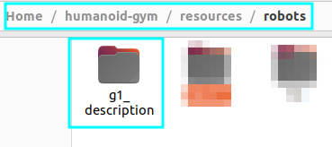
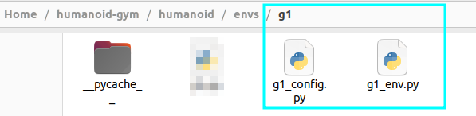
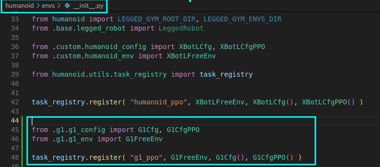
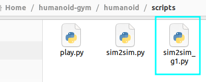
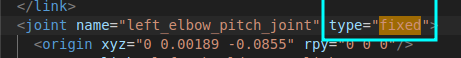
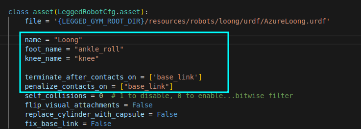
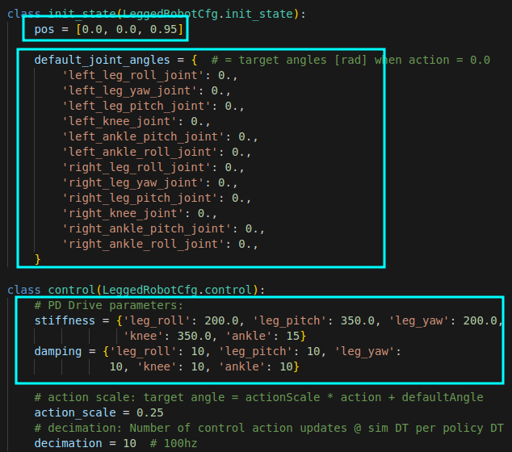
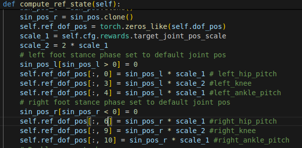
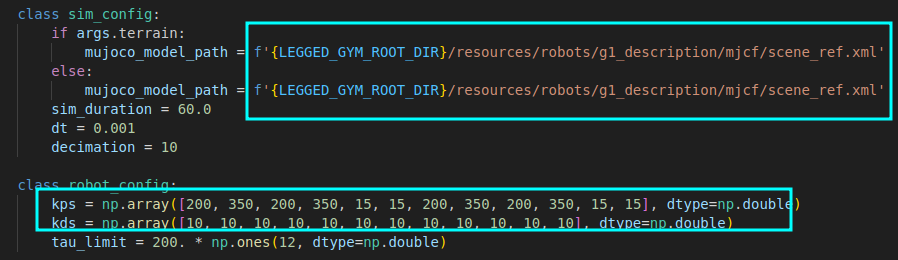

## Installation

1. Generate a new Python virtual environment with Python 3.8 using `conda create -n myenv python=3.8`.
2. For the best performance, we recommend using NVIDIA driver version 525 `sudo apt install nvidia-driver-525`. The minimal driver version supported is 515. If you're unable to install version 525, ensure that your system has at least version 515 to maintain basic functionality.
3. Install PyTorch 1.13 with Cuda-11.7:
   - `conda install pytorch==1.13.1 torchvision==0.14.1 torchaudio==0.13.1 pytorch-cuda=11.7 -c pytorch -c nvidia`
4. Install numpy-1.23 with `conda install numpy=1.23`.
5. Install Isaac Gym:
   - Download and install Isaac Gym Preview 4 from https://developer.nvidia.com/isaac-gym.
   - `cd isaacgym/python && pip install -e .`
   - Run an example with `cd examples && python 1080_balls_of_solitude.py`.
   - Consult `isaacgym/docs/index.html` for troubleshooting.
6. Install humanoid-gym:
   - Clone this repository.
   - `cd humanoid-gym && pip install -e .`


## Usage Guide

#### Examples

```bash
# Launching PPO Policy Training for 'v1' Across 4096 Environments
# This command initiates the PPO algorithm-based training for the humanoid task.
python scripts/train.py --task=humanoid_ppo --run_name v1 --headless --num_envs 4096

# Evaluating the Trained PPO Policy 'v1'
# This command loads the 'v1' policy for performance assessment in its environment. 
# Additionally, it automatically exports a JIT model, suitable for deployment purposes.
python scripts/play.py --task=humanoid_ppo --run_name v1

# Implementing Simulation-to-Simulation Model Transformation
# This command facilitates a sim-to-sim transformation using exported 'v1' policy.
python scripts/sim2sim.py --load_model /path/to/logs/XBot_ppo/exported/policies/policy_1.pt

# Run our trained policy
python scripts/sim2sim.py --load_model /path/to/logs/XBot_ppo/exported/policies/policy_example.pt

```
#### Run g1


- **Clone this repository**

- **Add the g1_description folder to resources/robots**


- **Add the folder g1 include config file and env file to envs**


- **register task in __init__.py**
```
from .g1.g1_config import G1Cfg, G1CfgPPO
from .g1.g1_env import G1FreeEnv

task_registry.register( "g1_ppo", G1FreeEnv, G1Cfg(), G1CfgPPO() )
```


- **Training Command**:
  ```
  python humanoid/scripts/train.py --task=g1_ppo --run_name v1 --headless --num_envs 4096
  ```
- **Running a Trained Policy**: 
  ```
  python humanoid/scripts/play.py --task=g1_ppo --run_name v1
  ```
- By default, the latest model of the last run from the experiment folder is loaded. However, other run iterations/models can be selected by adjusting `load_run` and `checkpoint` in the training config.
- **Sim-to-sim,add sim2sim_g1.py to scripts**:

```
python scripts/sim2sim_g1.py --load_model /path/to/humanoid-gym/logs/g1_ppo/exported/policies/policy_1.pt
```
#### Run your own urdf


- **Step 1 : Add the urdf folder to resources**
 modify the urdf file if needed.
 only 12 joints are used in humanoid-gym.so the type of unusing joints need to be changed from "revolute" to "fixed" in the urdf file.

   

- **Step 2 : Modify config file and env file in envs**




- **Step 3 : register your task in __init__.py**

- **Step 4 : Training Command**:
  ```
  python humanoid/scripts/train.py --task=xx_ppo --load_run log_file_path --name run_name
  ```
- **Step 5 : Running a Trained Policy**: 
  ```
  python humanoid/scripts/play.py --task=xx_ppo --load_run log_file_path --name run_name
  ```

- **Step 6 : im-to-sim**:
 transfer urdf to MJCF, add actuator in MJCF.xml.
 modify the sim2sim.py
 


## Troubleshooting

Observe the following cases:

```bash
# error
ImportError: libpython3.8.so.1.0: cannot open shared object file: No such file or directory

# solution
# set the correct path
export LD_LIBRARY_PATH="~/miniconda3/envs/your_env/lib:$LD_LIBRARY_PATH" 

# OR
sudo apt install libpython3.8

# error
AttributeError: module 'distutils' has no attribute 'version'

# solution
# install pytorch 1.12.0
conda install pytorch torchvision torchaudio cudatoolkit=11.3 -c pytorch

# error, results from libstdc++ version distributed with conda differing from the one used on your system to build Isaac Gym
ImportError: /home/roboterax/anaconda3/bin/../lib/libstdc++.so.6: version `GLIBCXX_3.4.20` not found (required by /home/roboterax/carbgym/python/isaacgym/_bindings/linux64/gym_36.so)

# solution
mkdir ${YOUR_CONDA_ENV}/lib/_unused
mv ${YOUR_CONDA_ENV}/lib/libstdc++* ${YOUR_CONDA_ENV}/lib/_unused
```

## Citation

Please cite the following if you use this code or parts of it:
```
@article{gu2024humanoid,
  title={Humanoid-Gym: Reinforcement Learning for Humanoid Robot with Zero-Shot Sim2Real Transfer},
  author={Gu, Xinyang and Wang, Yen-Jen and Chen, Jianyu},
  journal={arXiv preprint arXiv:2404.05695},
  year={2024}
}
```

## Acknowledgment

The implementation of Humanoid-Gym relies on resources from [legged_gym](https://github.com/leggedrobotics/legged_gym) and [rsl_rl](https://github.com/leggedrobotics/rsl_rl) projects, created by the Robotic Systems Lab. We specifically utilize the `LeggedRobot` implementation from their research to enhance our codebase.

